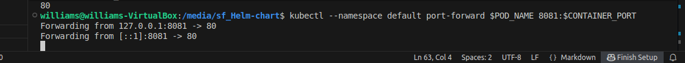

# Helm-chart## Working with Helm Chart

### Prerequisite:
- Ensure cluster runing(minikube, Docker)
- install Helm
- kubectl configured
### Create and Customize Your Helm Chart
### 1.1 Create the Helm Chart  Structure
```
         helm create webapp
         cd webapp
```
###  1.2 Modify values.yaml
Edit the values.yaml file with the following content:
 
 ```
   nano values.yaml
 ```  
 

### 1.3 Customize templates/deployment.yaml
Edit templates/deployment.yaml and replace the resources section with: 


### Step 4: Deploy Your Application


### 1 Deploy with Helm:
  
  - Navigate to the project root (where your webapp directory is)


   - Deploy the application to kubernates using the command:
  ```
     helm install my-webapp ./webapp
   ```
### 2 Verify deployment
```
kubectl get deployments
kubectl get pods
kubectl get services
```


### 3 Visit Application URl:
Get the appliaction URL by runing the following command

### Step 1: Get the pod name


### Step 2: Verify 
  

### Step 3: Get the container port


### Step 4: Port-forward to access in your browser
   


Then open the browser:
 localhost//8081
